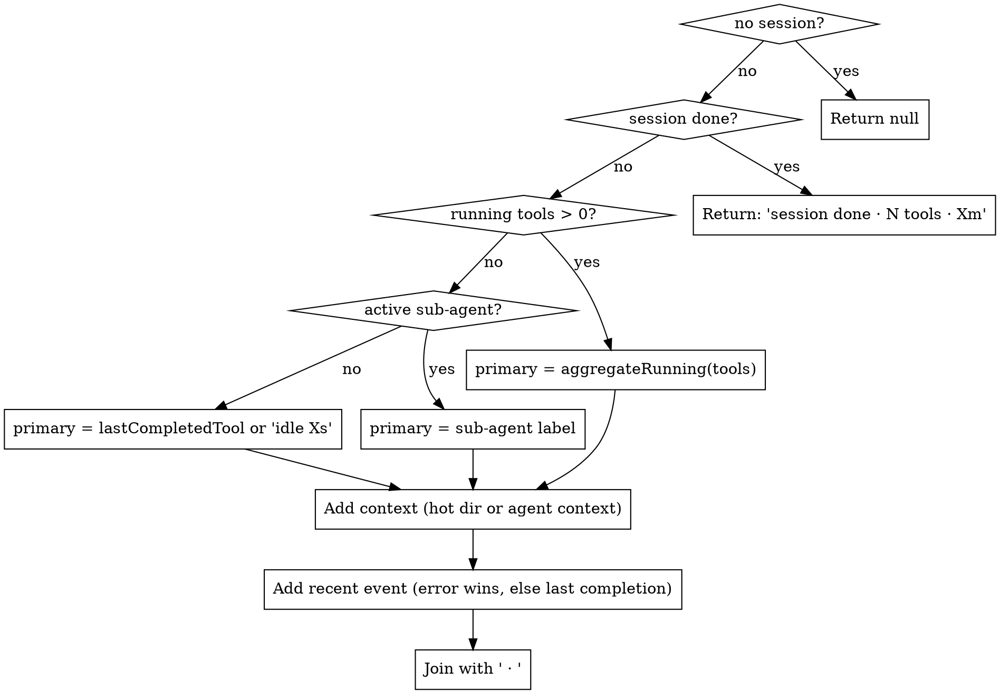

# Design — Live narrator (idée #1, release v0.3)

**Statut :** validé (décisions verrouillées)
**Cible :** v0.3
**Auteur :** Vincent (brainstormé avec Claude — voir `docs/superpowers/brainstorms/2026-05-07-irresistible-app-ideas.md`)

## Goal

Ajouter une **caption d'une ligne sous le topbar** qui décrit en temps réel ce que fait l'agent observé. Calculée client-side à partir de `state` — aucun LLM, aucun appel réseau supplémentaire. Différencie agent-viz d'autres dashboards d'observabilité dès la première seconde de visionnage.

Exemple, en pleine activité : `3 reads · auth/ · Bash done · 3 sub-agents`.

## Non-goals

- Pas de génération LLM (coût, latence, non-déterminisme — déjà arbitré dans le brainstorm).
- Pas de remontée d'anomalies dans le narrator (réservé à #3 Anomaly halos, v0.4).
- Pas d'affichage de cadence de coût / token-flow (réservé à #5 Burn rate dans la budget pill, v0.3 mais autre composant).
- Pas de FR — le reste de l'UI est en EN, le narrator suit.
- Pas de personnalisation utilisateur (vocabulaire, ton, langue) en v0.3 — `viz-narrator.js` reste un module fermé. Réévalué seulement si retour utilisateur explicite.

## Décisions verrouillées (issues du brainstorm)

| Axe | Décision |
|---|---|
| **Placement** | Bandeau dédié pleine largeur sous `#topbar`, au-dessus de `#main`. Hauteur fixe ~28 px. |
| **Vocabulaire** | Standard : tools en cours, hot directory, agent actif, dernier tool terminé, dernière erreur + ago, multi-agent, idle. |
| **Voix** | Télégraphique / statusline (V2) — noms et stats, séparateur middle-dot, pas de verbe d'action. |
| **Langue** | EN. |
| **Cadence** | Hybride : `markNarratorDirty()` posé dans les handlers d'events pertinents + tick 1 Hz pour les "Xs ago" et l'idle counter. Tick coupé quand l'onglet est caché (réutilise le pattern `pauseApp()` de `viz-network.js`). |
| **Visibilité** | Visible dès qu'une session est sélectionnée. Caché tant qu'aucun event n'est arrivé (pas de flicker à vide). En idle ≥ 5s, ligne affichée en couleur dim. Session terminée → phrase finale figée. |
| **Architecture** | Module isolé `public/viz-narrator.js`, pur. Pas d'extension de `state`. |

## Architecture

### Composants

```
viz-narrator.js  ─── compose(state, vis, now) → string
       │
       │   appelé par
       ▼
viz-ui.js        ─── renderNarrator() : DOM update
       │
       │   triggered by
       ▼
viz-layout.js    ─── markNarratorDirty() depuis chaque handler EVENT_HANDLERS
viz-narrator-tick ─── setInterval 1 Hz (armé/désarmé selon visibilité onglet)
```

### Module `public/viz-narrator.js`

Responsabilité **unique** : décider quoi dire. Aucun DOM, aucune horloge interne, aucun fetch.

**Surface publique** :

```js
// Compose la string narrator pour l'instant `now` à partir de l'état.
// Retourne null si rien à afficher (avant 1er event, ou session non sélectionnée).
// Retourne { text: string, tone: 'active'|'idle'|'error'|'done' } sinon.
export function composeNarrator(state, vis, now);

// Petite struct utilitaire — extrait le préfixe commun à un set de chemins.
// Exposé pour tests unitaires (heuristique non-triviale).
export function commonPathPrefix(paths);
```

Le tone permet à `viz-ui.js` de moduler la couleur (active = `--holo-bright`, idle = `--text-muted`, error = teinte ambre, done = `--complete`). C'est une donnée **dérivée**, pas une prop calculée séparément.

### Slots de la phrase

Un narrator output se compose de **1 à 3 clauses** assemblées avec ` · ` :

| Slot | Source | Exemples (V2) |
|---|---|---|
| **primary** (toujours présent dès qu'on a la matière) | running tools / current agent / idle | `3 reads`, `Bash`, `Edit user.js`, `idle 23s` |
| **context** (optionnel) | un seul des trois — par ordre de priorité : (1) `"N sub-agents"` si N ≥ 2 concurrents, (2) nom du sub-agent actif si on n'est pas sur le main thread, (3) hot directory si dérivable | `3 sub-agents`, `code-reviewer`, `auth/` |
| **recent event** (optionnel, gagne sur context si erreur récente) | dernière erreur < 60s, ou dernier tool terminé < 10s | `err 14s`, `Bash done` |

**Règle d'assemblage** : on n'écrit jamais de clause vide ni de séparateur en trop. 1 clause → 1 clause, point. Adaptatif.

### Heuristique de composition (haut niveau)



#### `aggregateRunning(tools)` — règle de regroupement

- Si **tous les tools running** sont du même type (Read uniquement) : `"3 reads"` (pluriel anglais s'il y en a >1, sinon `"Read"`).
- Si **types mixtes** : on prend le type majoritaire et on suffixe `+N` pour les autres : `"3 reads +2"`.
- Si **un seul tool** : libellé du tool, optionnellement avec son sub si court (< 25 chars) : `"Edit user.js"`, `"Bash"`.
- **Tools running attribués à un sub-agent** : non agrégés dans le primary du main thread — c'est le sub-agent qui devient primary (`"code-reviewer"`).

#### `commonPathPrefix(paths)` — hot directory

- Inputs : tous les `n.sub` des **5 derniers** tools `Read|Edit|Write` terminés (regardé dans `state.timelineEntries`, filtre par type/label).
- Sort le préfixe de chemin commun, **un répertoire au minimum** (pas de prefix d'un seul caractère). Exemple : `["auth/login.js", "auth/middleware.js", "auth/utils/jwt.js"]` → `"auth/"`.
- Si pas de préfixe convergent ou < 2 fichiers : `null` → slot `context` vide.
- Note : on lit `n.sub` parce que `formatToolSub()` (viz-layout.js:343) extrait déjà le `file_path` côté layout. Pas de re-parsing du `tool_input`.

#### `recentEvent` — règle de priorité

- `lastErrorTs` et `lastCompletionTs` sont calculés en scannant les ~50 dernières entrées de `state.timelineEntries` à chaque appel (capacité bornée → coût O(50), négligeable).
- Si `now − lastErrorTs < 60s` → `"err Xs"`. Sinon, si `now − lastCompletionTs < 10s` → `"<ToolName> done"`.
- Au-delà → slot `recent event` vide.

### Intégration `viz-layout.js`

**Une ligne** dans la table `EVENT_HANDLERS`, au niveau du dispatcher `processEvent`. Pas de mutation de chaque handler — on observe **après** le handler, pas dedans :

```js
// viz-layout.js — patch chirurgical dans processEvent (déjà au bon endroit)
import { markNarratorDirty } from './viz-narrator.js';

export function processEvent(evt) {
  // ... existing dispatch ...
  if (handler) handler(evt, sid, ts);
  markNarratorDirty();   // ← unique addition
}
```

`markNarratorDirty()` est exporté par `viz-narrator.js` (DIP : la couche layout ne sait pas comment le narrator se rend, juste qu'il y a quelque chose à invalider).

### Intégration `viz-ui.js`

```js
// viz-ui.js
import { composeNarrator } from './viz-narrator.js';

const _narrEl = document.getElementById('narrator');

export function renderNarrator() {
  const result = composeNarrator(state, vis, Date.now());
  if (!result) {
    _narrEl.hidden = true;
    return;
  }
  _narrEl.hidden = false;
  _narrEl.textContent = result.text;
  _narrEl.dataset.tone = result.tone;
}
```

Le throttle 1 Hz et le `markNarratorDirty()` sont gérés **dans `viz-narrator.js`**, qui appelle `renderNarrator` via un callback injecté à l'init. Pas d'import circulaire — la dépendance va `viz-ui → viz-narrator`, et `viz-narrator → viz-ui` se fait par injection.

### Cycle de vie du tick 1 Hz

- **Armé** au chargement du module (`setInterval(markNarratorDirty, 1000)`). Coût d'un tick à vide ~ O(50) → négligeable, ne justifie pas une logique on/off complexe.
- **Désarmé** quand l'onglet passe `hidden` — branchement dans `pauseApp()` (viz-network.js:262). `viz-narrator.js` exporte `pauseTick()` / `resumeTick()` que `pauseApp` / `resumeApp` appellent comme ils appellent déjà `stopDurationsTicker()`.
- **Hide instantané sur switch de session** : `clearState()` (viz-network.js) appelle `markNarratorDirty()` à la fin → le rendu suivant voit `state` vide et masque le bandeau. Pas de flicker.

### DOM / CSS

**HTML — `index.html`** :
```html
<div id="app">
  <div id="topbar">…</div>
  <div id="narrator" hidden></div>   <!-- NEW -->
  <div id="main">…</div>
</div>
```

**CSS — `viz.css`** :
```css
#app { grid-template-rows: 48px auto 1fr; }   /* était 48px 1fr */
#narrator {
  background: rgba(102,204,255,0.04);
  border-bottom: 1px solid rgba(102,204,255,0.10);
  color: var(--holo-bright);
  font-size: 11px;
  padding: 6px 20px;
  letter-spacing: 0.2px;
  font-variant-numeric: tabular-nums;
  white-space: nowrap;
  overflow: hidden;
  text-overflow: ellipsis;
}
#narrator[data-tone="idle"]  { color: var(--text-muted); }
#narrator[data-tone="error"] { color: var(--notification); }
#narrator[data-tone="done"]  { color: var(--complete); }
```

`auto` plutôt que valeur fixe pour la row : la barre prend exactement sa hauteur naturelle, et quand `hidden` la row se collapse à 0 (le canvas reprend tout l'espace).

## Data flow

```
hook event (SSE)
   │
   ▼
viz-network.js  ── processEvent ──┐
                                  ▼
                       viz-layout.js (mute state)
                                  │
                                  ▼
                       markNarratorDirty()
                                  │
                  ┌───────────────┘
                  │
                  ▼
            viz-narrator.js
                  │ (microtask coalesced)
                  ▼
            composeNarrator(state, vis, now)
                  │
                  ▼
            renderNarrator() ──── DOM update
```

Le tick 1 Hz emprunte le **même chemin** que `markNarratorDirty()` — il appelle simplement `markNarratorDirty()` chaque seconde. Un seul flux de mise à jour, pas deux.

## Erreur, edge cases, garde-fous

| Situation | Comportement |
|---|---|
| Aucune session sélectionnée | `composeNarrator` retourne `null` → bandeau `hidden` |
| Session sélectionnée, 0 event reçu | Bandeau `hidden` (pas de flicker à vide) |
| Beaucoup de tools running de types très variés | Type majoritaire + `+N` pour les autres |
| `state.timelineEntries` shrink (ring-buffer) | Aucun problème — on lit toujours sur la queue, pas de pointeur persisté |
| Onglet caché > 2s | `pauseApp()` arrête le tick (rejoint pattern existant) |
| Switch de session | Le narrator se réinitialise via le `clearState()` existant (pas de state propre à reset → rien à faire de plus) |
| Multi-fork agent (forked sub-agent) | Le `current sub-agent` est le **dernier** qui a émis un PreToolUse non terminé — heuristique simple, pas besoin d'inspecter le forkedAgentParents Map |

## Perf

Budget cible : **< 0.5 ms** par appel à `composeNarrator()` (mesuré en dev avec un graphe à 50 nœuds + 500 entrées timeline).

- `aggregateRunning` itère sur `vis.runningNodes` (Set, taille typique < 10).
- `commonPathPrefix` itère sur les 5 derniers Read/Edit/Write — O(5).
- `recentEvent` scan les ~50 dernières timeline entries — O(50).
- `formatTokens`/conversions : aucune (le narrator ne touche pas aux tokens).

Le tick 1 Hz a donc un coût négligeable. Le `markNarratorDirty()` event-driven coalesce via microtask comme le `scheduleRender` existant — bursts de 10 events ne déclenchent qu'un seul recalc.

## Tests

Unit tests dans `tests/unit/narrator.test.js` (suit le pattern `tests/unit/*.test.js` existant — node:test runner).

Cas couverts :

1. `composeNarrator` avec state vide → `null`.
2. Un seul Read running, sub `"auth/login.js"` → `text: "Read"`, tone `active`.
3. 3 Reads running, mêmes paths sous `"auth/"` → `text: "3 reads · auth/"`, tone `active`.
4. 3 Reads + 1 Edit running → `text: "3 reads +1"`, tone `active`.
5. Erreur il y a 14s, pas de tool running, idle 30s → `text: "idle 30s · err 14s"`, tone `error`.
6. Session done avec 42 tools, durée 3.2 min → `text: "session done · 42 tools · 3.2m"`, tone `done`.
7. `commonPathPrefix(["a/b/c.js", "a/b/d.js", "a/x/y.js"])` → `"a/"`.
8. `commonPathPrefix(["a.js", "b.js"])` → `null` (pas de prefix > 1 char ou < 1 répertoire).
9. Tool running attribué à sub-agent `code-reviewer` (pas main thread) → `text: "code-reviewer · …"`.

Pas de test d'intégration DOM (la valeur ajoutée est dans la décision, pas dans le `textContent =`).

## Out of scope (déférés)

- **Hover tooltip détaillé** sur le narrator (montrer la liste complète des running tools, breakdown par sub-agent). Si demande utilisateur après v0.3.
- **Click → focus** sur le tool / agent référencé dans la phrase. Idem.
- **Internationalization** (FR + autres). Verrouillé en EN pour v0.3, refactorisable plus tard via une fonction de traduction par slot.
- **Customisation utilisateur** (toggle on/off, choix de voix). Pas avant retour explicite d'un user.

## Conformité SOLID (CLAUDE.md)

- **S** — `viz-narrator.js` a une seule raison de changer : la grammaire/heuristique du narrator. Pas d'I/O, pas de DOM, pas de réseau.
- **O** — Ajout d'une nouvelle source de fait (ex. "burn rate exceeded") = ajouter une entrée à un éventuel registre interne, pas modifier `composeNarrator`. Pour v0.3 ce n'est pas nécessaire (3 slots suffisent), mais la structure le permet.
- **L** — Pas d'héritage donc trivialement respecté. Le contrat de `composeNarrator` est strict (`null | { text, tone }`).
- **I** — `composeNarrator` prend uniquement ce qu'il consomme : `state`, `vis`, `now`. Pas un objet "context bag" qui sait tout faire.
- **D** — La couche layout ne dépend pas du DOM du narrator : elle appelle `markNarratorDirty()`, abstraction. Le rendu DOM est injecté depuis `viz-ui.js` côté init.

## Roadmap (rappel brainstorm)

Cette release embarque aussi #5 (burn rate) et #6 (efficiency grade) — ils touchent la `budget-pill` et n'interfèrent pas avec le narrator. Ils feront l'objet de leur propre design / plan séparé.

## Prochaine étape

Plan d'implémentation détaillé via la skill `writing-plans`.
